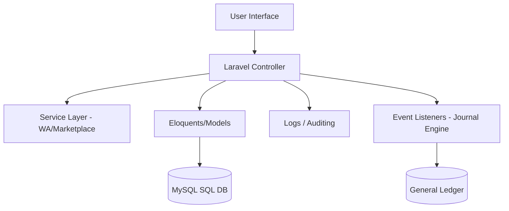

# System Architecture

## Architecture Overview
The Diego Music Store ERP uses a monolithic Model-View-Controller (MVC) architecture with service layers for third-party integrations and event listeners for automated accounting journals.

## Multi-Tenant / Branch Isolation
- All operational tables (`penjualan`, `stok`, `jurnal_umum`, `pengeluaran`) contain a `cabang_id` column.
- Global scopes are implemented in Laravel models to automatically filter data based on the authenticated user's active branch.

## Offline Architecture
- Front Desk POS runs a **Service Worker** to cache UI assets.
- Transactions are queued locally in **IndexedDB** using a FIFO structure if connection drops.
- Upon reconnection, a synchronization script fires the queue back to the server in strict order to avoid inventory conflicts.
