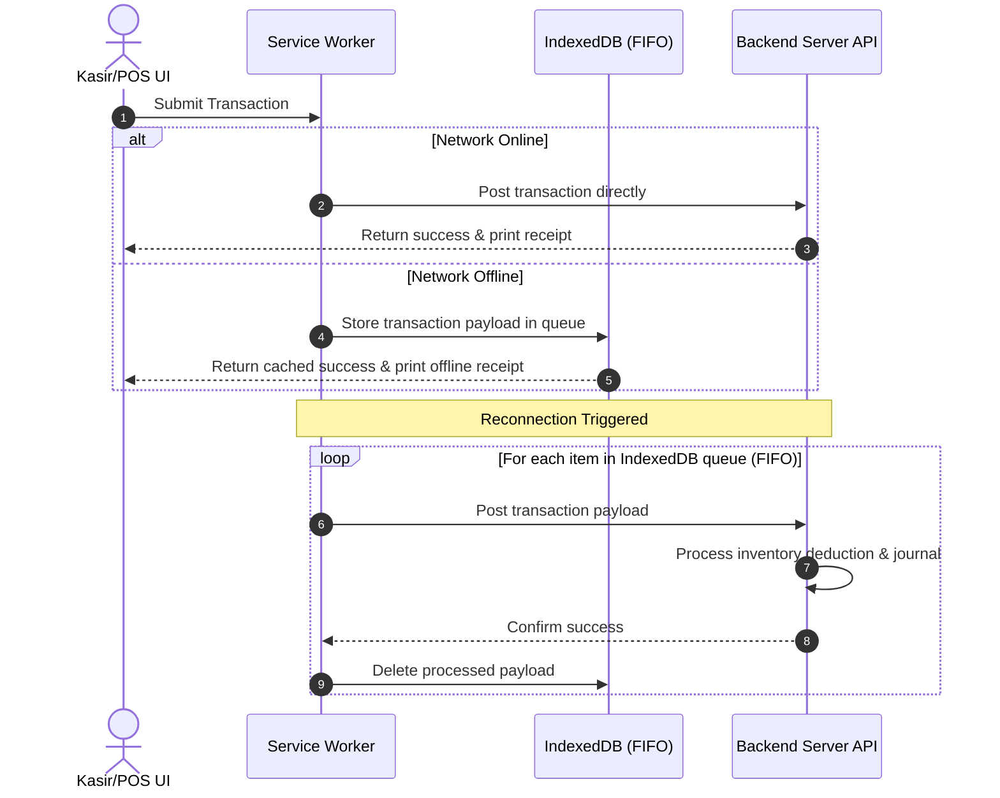
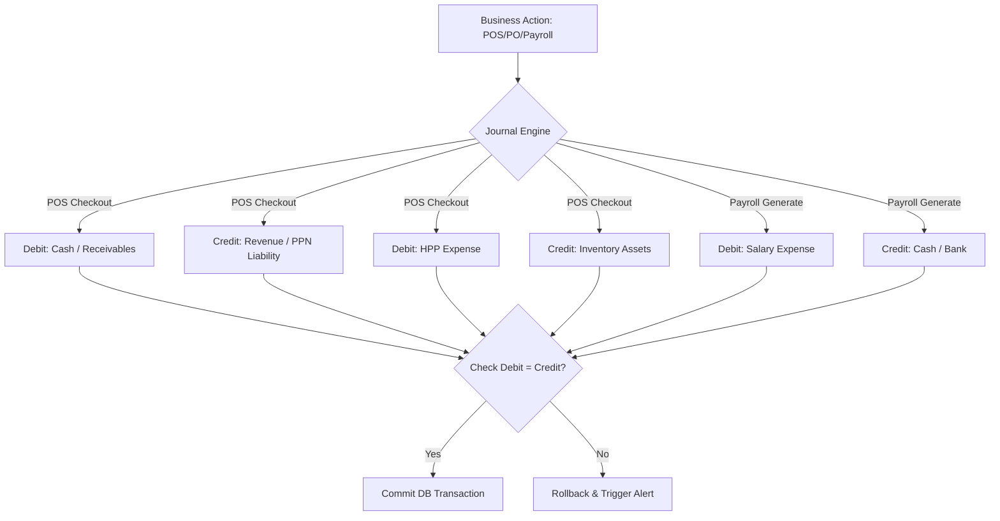

# Architecture Diagrams

## 1. Offline POS FIFO Sync Queue
This diagram shows the Service Worker flow capturing requests offline and syncing them back sequentially when connectivity resumes.

## 2. Double-Entry Accounting Engine Flow
This flowchart shows how business actions map automatically to double-entry ledger columns.

