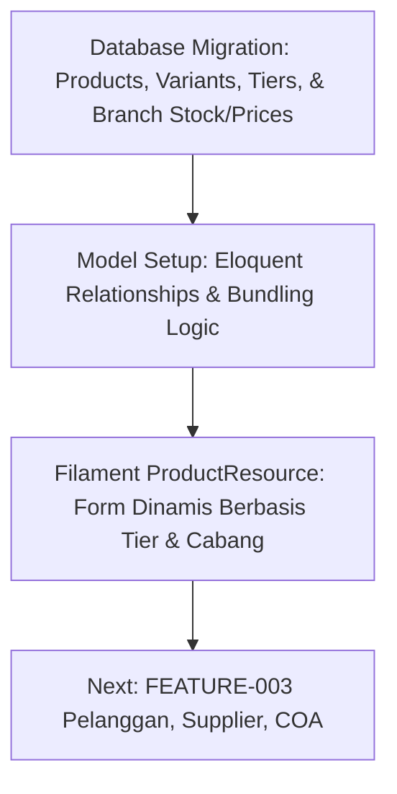

# Proposal Langkah Selanjutnya: Pengembangan ERP Diego Music Store

Dokumen ini menganalisis status proyek saat ini dan memberikan rekomendasi langkah pengembangan selanjutnya berdasarkan [PRD_DIEGO_MUSIC_STORE.md](file:///home/skylantern/Projects/diego-music-store-project/PRD_DIEGO_MUSIC_STORE.md) dan [KEBUTUHAN_APLIKASI_BISNIS.md](file:///home/skylantern/Projects/diego-music-store-project/KEBUTUHAN_APLIKASI_BISNIS.md).

---

## 1. Status Proyek Saat Ini (Sprint 1)
Kita telah menyelesaikan fondasi utama di **Sprint 1 (Master Data & Basic Settings)**:
*   [x] **Database & Branch Isolation (TASK-001)**: Setup skema database awal, isolasi data berbasis cabang (`cabang_id`), dan pivot table.
*   [x] **RBAC & User Management (TASK-002)**: Setup Spatie Roles (Owner, Admin, Kasir, Sales, Teknisi) dan integrasi user management di Filament.
*   [x] **Penataan Navigation Groups**: Mengelompokkan resource `User` ke dalam **Kelola User** dan `Branch` ke dalam **Master Data**.

---

## 2. Perbandingan Opsi Langkah Selanjutnya

Untuk menyelesaikan **Sprint 1**, ada dua fitur besar (Epic Master Data) yang perlu kita bangun berikutnya:

### Opsi A: FEATURE-002 - CRUD Master Barang & Varian (Sangat Direkomendasikan)
Fokus pada pembangunan skema database dan antarmuka manajemen produk:
*   **Item Pekerjaan**:
    1.  Tabel `products` (SKU/Barcode, tipe Fisik/Bundling/Jasa, HPP, Harga Beli).
    2.  Tabel `product_variants` (Warna, Ukuran, dll. dengan SKU dan stok tersendiri).
    3.  Tabel `product_bundles` (Relasi komposisi produk paket).
    4.  Tabel `pricing_tiers` (Definisi nama tingkatan harga dinamis seperti Emas, Perak).
    5.  Tabel `product_tier_prices` & `product_branch_prices` (Penyimpan nominal harga per tier dan per cabang).
    6.  Filament Resource untuk `PricingTier` dan `Product` (dengan form dinamis berdasarkan tier & cabang yang aktif).
*   **Kenapa ini prioritas tinggi?** 
    *   **Bloking Transaksi**: Kita tidak bisa membangun modul Kasir / POS (Sprint 2) tanpa memiliki katalog barang yang siap dijual.
    *   **Logika Bisnis Utama**: HPP, stok minimum, varian, dan pricing tiers adalah jantung dari alur pergudangan dan kasir.

### Opsi B: FEATURE-003 - CRUD Pelanggan, Supplier, & COA Dasar
Fokus pada pengelolaan entitas luar dan pondasi keuangan:
*   **Item Pekerjaan**:
    1.  Tabel `customers` (loyalty member, poin belanja, deposit).
    2.  Tabel `suppliers` (kontak, saldo hutang).
    3.  Tabel `accounts` (COA - Chart of Accounts untuk penjurnalan otomatis).
*   **Kenapa ini bisa menyusul?**
    *   Transaksi kasir dasar (POS) bisa berjalan menggunakan akun pelanggan "Cash/Umum" tanpa harus menunggu CRM lengkap selesai.
    *   Penjurnalan akuntansi (COA) baru akan aktif digunakan di Sprint 5 ketika mesin pembukuan (Double-Entry Engine) diimplementasikan.

---

## 3. Rekomendasi Alur Kerja (Roadmap Teknis)

Kami menyarankan untuk fokus pada **FEATURE-002 (Master Barang & Varian)** terlebih dahulu dengan pembagian tugas sebagai berikut:

### Rincian Sub-Task untuk FEATURE-002:
1.  **TASK-003**: Migrasi Database (`products`, `product_variants`, `product_bundles`, `pricing_tiers`, `product_tier_prices`, `product_branch_prices`).
2.  **TASK-004**: Eloquent Models dengan logika dynamic stock untuk produk bundling dan flag unlimited untuk jasa.
3.  **TASK-005**: Filament `PricingTierResource` & `ProductResource` yang memiliki form input dinamis (mengambil semua tier & cabang aktif secara dinamis, tab varian, dan pemilihan item bundling).

---

## 4. Pertanyaan / Masukan dari User
Sebelum kita memulai pembuatan migrasi dan resource produk:
1.  Apakah Anda setuju kita lanjut ke **FEATURE-002 (Master Barang & Varian)** terlebih dahulu?
2.  Apakah ada properti tambahan di tingkat pricing tier (selain Nama dan Deskripsi) yang perlu kita simpan sejak awal?
