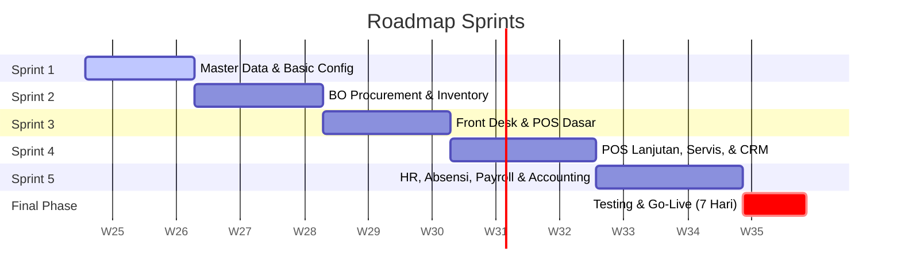

# Roadmap: ERP Diego Music Store

Development timeline spans **2 Months and 21 Days (81 Calendar Days)**:
- **74 Days** Development
- **7 Days** Testing & Go-Live

---

## Roadmap Sprints

### Sprint 1: Master Data & Basic Settings (Hari 1 - 12)
- Database schema, routing setup, multi-tenant/branch configs.
- CRUD: Pelanggan, Supplier, Gudang, COA dasar, User, dan Cabang.
- Master Barang & Varian, Loyalty member.
- Shop header/footer struk template.

### Sprint 2: Back Office Procurement & Inventory (Hari 13 - 26)
- CRUD Satuan Produk (UoM) & integrasi form input barang.
- Purchase Order (PO) & Delivery Order (DO) / Penerimaan Barang.
- Perhitungan HPP Rata-rata Terbobot (Weighted Average) teratribusi ongkir.
- Mutasi Stok antar-cabang dengan pelacak status (In-Transit).
- Stok Opname (Fisik vs Sistem) & penyesuaian selisih otomatis.
- Kartu Stok per barang per gudang cabang.

### Sprint 3: Front Desk & POS Dasar (Hari 27 - 40)
- Sesi Kasir Harian (Open/Close cash, laci, blind count, cancel session).
- Core POS (Single payment, thermal receipt, hold/recall).
- Pelunasan Piutang & POS Reports.
- Info/bar absensi kasir.

### Sprint 4: POS Lanjutan, Servis, & CRM (Hari 41 - 56)
- Mix Payment & Pricing tier.
- Downpayment/Booking inden.
- Partial returns.
- Service Management (Kanban, sparepart list, auto-invoice POS).
- WhatsApp Gateway (Invoice WA, reminders, broadcasts).
- Offline mode (Service Workers + IndexedDB FIFO).

### Sprint 5: HR, Absensi, Penggajian & Accounting (Hari 57 - 72)
- Attendance integration (Fingerprint, photo geotagging).
- Kasbon / Cash Advance & cycle deduction.
- Penalty Points & auto deduction.
- Sales Commissions (flat/tier) & KPI.
- Auto Payroll calculations, bank transfer exports, and WA Slip delivery.
- Double-entry engine: auto posting POS/PO/Payroll journal, General Ledger, Neraca, Laba Rugi.
- Marketplace Sync (Shopee & Tokopedia).
- Owner Dashboard charts.

### Phase 6: Testing & Go-Live (Hari 73 - 79)
- SIT (System Integration Testing) & Offline sync failover.
- UAT (User Acceptance Testing) with Owner, cashier, technicians.
- Load testing & SQL indexing tuning.
- Data Migration & Go-Live.
