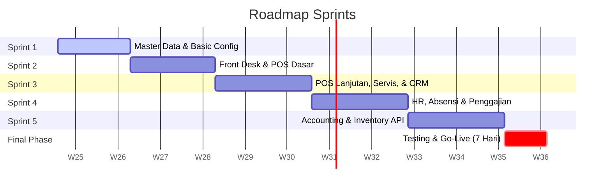

# Roadmap: ERP Diego Music Store

Development timeline spans **2 Months and 21 Days (81 Calendar Days)**:
- **74 Days** Development
- **7 Days** Testing & Go-Live

---

## Roadmap Sprints

### Sprint 1: Master Data & Basic Settings (Hari 1 - 12)
- Database schema, routing setup, multi-tenant/branch configs.
- CRUD: Pelanggan, Supplier, Gudang, COA dasar, User, dan Cabang.
- Master Barang & Varian, Loyalty member.
- Shop header/footer struk template.

### Sprint 2: Front Desk & POS Dasar (Hari 13 - 26)
- Sesi Kasir Harian (Open/Close cash, laci, blind count, cancel sesion).
- Core POS (Single payment, thermal receipt, hold/recall).
- Pelunasan Piutang & POS Reports.
- Info/bar absensi kasir.

### Sprint 3: POS Lanjutan, Servis, & CRM (Hari 27 - 42)
- Mix Payment & Pricing tier.
- Downpayment/Booking inden.
- Partial returns.
- Service Management (Kanban, sparepart list, auto-invoice POS).
- WhatsApp Gateway (Invoice WA, reminders, broadcasts).
- Offline mode (Service Workers + IndexedDB FIFO).

### Sprint 4: HR, Absensi & Penggajian (Hari 43 - 58)
- Attendance integration (Fingerprint, photo geotagging).
- Kasbon / Cash Advance & cycle deduction.
- Penalty Points & auto deduction.
- Sales Commissions (flat/tier) & KPI.
- Auto Payroll calculations, bank transfer exports, and WA Slip delivery.

### Sprint 5: Inventaris, Akuntansi Double-Entry, & Integrasi API (Hari 59 - 74)
- Procurement (PO/DO verification), branch inventory mutations.
- Weighted Average HPP tracking.
- Double-entry engine: auto posting POS/PO/Payroll journal, General Ledger, Neraca, Laba Rugi.
- Marketplace Sync (Shopee & Tokopedia).
- Owner Dashboard charts.

### Phase 6: Testing & Go-Live (Hari 75 - 81)
- SIT (System Integration Testing) & Offline sync failover.
- UAT (User Acceptance Testing) with Owner, cashier, technicians.
- Load testing & SQL indexing tuning.
- Data Migration & Go-Live.
