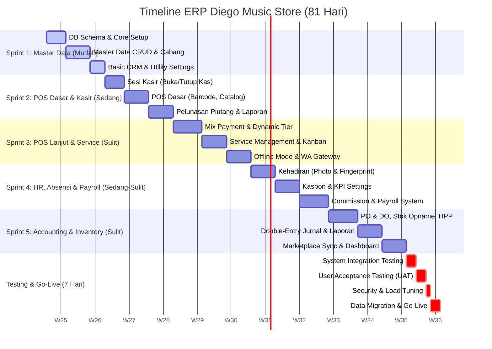

# Rencana & Timeline Pengerjaan ERP Diego Music Store
*Dokumen Rencana Kerja dan Distribusi Fitur Berdasarkan Kompleksitas*

---

> [!NOTE]
> **Metrik Utama Proyek:**
> - **Total Durasi:** 2 Bulan 21 Hari (81 Hari Kalender)
> - **Alokasi Kerja:** 74 Hari Pengembangan (Development) + 7 Hari Pengujian (Testing & UAT)
> - **Metodologi:** Agile Scrum dengan pembagian 5 Sprint Pengembangan dan 1 Sesi Rilis/Testing Akhir.

---

## 1. Visualisasi Timeline (High-Level Gantt Chart)

Berikut adalah visualisasi alur pengerjaan ERP Diego Music Store menggunakan diagram Gantt:



---

## 2. Kategorisasi Kompleksitas Fitur

Fitur-fitur dikelompokkan berdasarkan estimasi tingkat kesulitan teknis dan dependensinya. Proses pengembangan dimulai dari **Mudah** untuk membangun pondasi database yang kokoh, berlanjut ke **Sedang** untuk operasional, hingga **Sulit** untuk logika bisnis kompleks (seperti akuntansi, integrasi API pihak ketiga, sinkronisasi offline, dan otomasi payroll).

| Tingkat Kesulitan | Kategori Modul / Fitur | Deskripsi Fungsional | Dependensi Utama |
| :--- | :--- | :--- | :--- |
| **Mudah (Easy)** | Data Master, CRUD Dasar, & Konfigurasi | - CRUD Pelanggan, User, Supplier, Gudang, Satuan<br>- CRUD Barang & Varian (Master stok dasar)<br>- Registrasi Cabang & Akses Cabang<br>- Setting Informasi Toko & Template Struk<br>- Tampilan Bar Absensi Kasir (Read-only) | Skema Database Inti |
| **Sedang (Medium)** | POS Dasar, Absensi, Kasbon, & Dashboard Dasar | - Sesi Kasir Harian (Buka/Tutup Kas, Modal Awal)<br>- Core POS (Scan barcode, add to cart, cash payment)<br>- Pelunasan Piutang Pelanggan<br>- Check-in Absensi Foto (Geotagging) & Face Lock<br>- Pengajuan Kasbon & Cicilan Karyawan<br>- Dashboard Sales & Leaderboard sederhana | - Data Master<br>- Database Sesi Kasir |
| **Sulit (Hard)** | POS Lanjutan, Akuntansi, Rantai Pasok, Payroll, Servis, Offline, & API | - POS: Mix Payment, Dynamic Pricing Tier, PPN otomatis<br>- Deposit Pelanggan (DP/Booking)<br>- Retur Penjualan Parsial/Total & Jurnal Retur<br>- Servis Musik: Alur Kanban, Sparepart HPP, POS integration<br>- Accounting: Jurnal Otomatis POS/PO/Payroll, Buku Besar, Neraca, Laba Rugi per Cabang & Konsolidasi, Depresiasi Aset<br>- Procurement & Stock: PO/DO Matching, Mutasi Antar-Cabang (In-Transit), Stok Opname & Auto-Journal Selisih, Average Weighted HPP<br>- Payroll: Rekap Gaji + KPI + Potongan Penalty Point Denda Telat, Komisi Sales Bertingkat, Slip PDF & WA Auto-send<br>- Integrasi: WA Gateway API, Shopee & Tokopedia Sync, Offline Mode (Service Worker + IndexedDB) | - Integrasi API Eksternal<br>- Jurnal Accounting Engine<br>- Browser Service Worker |

---

## 3. Rencana Detail Sprint (74 Hari Pengembangan)

### Sprint 1: Master Data & Basic Settings (Hari 1 - 12)
*Fokus pada perancangan database, hak akses user, registrasi multi-cabang, dan CRUD master data dasar.*
- **Hari 1 - 4: Database Schema & Core Setup**
  - Desain skema database SQL terenkripsi dan multi-tenant (pemisahan data cabang).
  - Setup routing dasar, otentikasi User (Owner, Admin, Kasir, Sales), dan manajemen Role-Based Access Control (RBAC).
- **Hari 5 - 9: Master Data CRUD & Multi-Cabang**
  - Implementasi CRUD Data Pelanggan, Supplier/Vendor, Satuan Barang, Kategori Penjualan, Lokasi Gudang, dan Chart of Accounts (COA) dasar.
  - Modul Registrasi Cabang Baru & Konfigurasi Hak Akses Cabang (pembatasan login berdasarkan lokasi cabang).
  - CRUD Master Barang & Varian (Input SKU/Barcode, HPP dasar, gambar produk, tipe produk fisik/bundling/jasa).
- **Hari 10 - 12: Basic CRM & Utility Settings**
  - Modul Loyalty Member & Poin Pelanggan (pencatatan rasio poin dasar).
  - Pengaturan informasi toko utama, konfigurasi header/footer struk thermal, dan fitur cetak barcode label.
- **Deliverables Sprint 1:** Panel admin back-office yang mampu mengelola cabang, user, dan seluruh master data produk siap pakai.

---

### Sprint 2: Front Desk & POS Dasar (Hari 13 - 26)
*Fokus pada modul POS standar, sesi kas harian, penanganan piutang, dan pelaporan POS.*
- **Hari 13 - 16: Sesi Kas Laci (Kas Harian)**
  - Fitur Buka Sesi (Input uang kas awal laci).
  - Tracking estimasi kas real-time di laci kasir selama transaksi berjalan.
  - Fitur Tutup Sesi (Blind counting uang fisik riil, kalkulasi otomatis selisih kurang/lebih kas, cetak Z-Report).
  - Otorisasi Supervisor/Owner (PIN/Password) untuk pembatalan/cancel tutup kas.
- **Hari 17 - 21: POS Core (Point of Sale)**
  - Antarmuka POS Kasir (Katalog visual, Scan Barcode, Keranjang Belanja, Edit Qty, Pemilihan Sales Rep).
  - Transaksi Penjualan Tunai/Single Payment (Cash/Transfer/QRIS/EDC) dan hitung kembalian otomatis.
  - Hold/Recall Transaksi Sementara (Simpan antrean belanja).
  - Cetak struk penjualan thermal.
- **Hari 22 - 26: Pelunasan Piutang, Retur POS, & Laporan POS**
  - Modul Pelunasan Piutang Pelanggan (pembayaran kredit berjalan, cetak bukti pelunasan).
  - Laporan Harian POS (Rekap penjualan, mutasi laci, piutang, daftar stok dan harga).
  - Info/Bar Absensi Kasir di POS (indikator jatah off day hijau/merah).
- **Deliverables Sprint 2:** POS Kasir yang bisa digunakan untuk transaksi tunai langsung dengan kontrol sesi laci kasir yang aman.

---

### Sprint 3: POS Lanjutan, Servis, & Notifikasi CRM (Hari 27 - 42)
*Fokus pada fitur transaksi kompleks, modul servis instrumen musik, sinkronisasi offline, dan integrasi WhatsApp.*
- **Hari 27 - 32: Advanced POS Features**
  - Pilihan metode pembayaran gabungan (Mix Payment: Cash + Transfer, QRIS + Debit, dll.) beserta sub-form EDC (4 digit kartu, trace number).
  - Logika Harga Bertingkat Dinamis (tiering harga ritel global/per-item otomatis saat member terdeteksi).
  - Input PPN Transaksi fleksibel (nominal / persentase).
  - Modul Deposit Pelanggan (DP/Booking Inden barang) dan integrasi potong deposit di POS.
  - Modul Retur Penjualan Parsial/Total (input alasan retur, refund cash/voucher, status barang layak jual vs rusak).
- **Hari 33 - 37: Modul Servis Musik (Service Management)**
  - Pembuatan tiket Servis Masuk (merk, no seri, checklist kelengkapan aksesoris, estimasi biaya).
  - Kanban Board Pelacakan Status Servis (Antrean -> Dikerjakan -> Menunggu Part -> Siap Diambil -> Closed).
  - Penggunaan suku cadang (memotong stok gudang) + biaya jasa teknisi.
  - Integrasi konversi langsung tiket servis selesai menjadi invoice POS kasir.
- **Hari 38 - 42: WhatsApp Gateway & Offline POS Mode**
  - Integrasi API WhatsApp Gateway: WhatsApp Invoice PDF otomatis pasca-lunas, WhatsApp Reminder tagihan piutang, WA Broadcast promo.
  - Setup Service Worker & IndexedDB untuk Offline Mode (antrean transaksi FIFO saat koneksi mati, auto-sync tanpa duplikasi saat online).
- **Deliverables Sprint 3:** Modul POS berkemampuan penuh, alur servis musik terintegrasi, notifikasi struk WhatsApp, dan ketahanan transaksi offline.

---

### Sprint 4: HR, Absensi & Penggajian (Hari 43 - 58)
*Fokus pada pencatatan kehadiran karyawan, aturan denda, kasbon, komisi sales rep, dan otomasi slip gaji.*
- **Hari 43 - 47: Kepegawaian & Absensi Terintegrasi**
  - Penarikan data absensi dari mesin fingerprint/face lock via API/file transfer.
  - Fitur check-in/out foto visual + geotagging GPS untuk sales dinas luar.
  - Formulir pengajuan absensi backdate (dengan alur persetujuan Admin/Owner).
  - Papan Kalender Kehadiran Karyawan (kehadiran, cuti, sisa off day).
- **Hari 48 - 52: Pengajuan Kasbon, KPI, & Denda (Penalty Points)**
  - Sistem pengajuan Kasbon Karyawan, cicilan berkala, kartu kendali sisa saldo kasbon.
  - Pembuatan template KPI per jabatan (target penjualan, absensi, keterlambatan) yang terhubung bonus.
  - Aturan Penalty Points denda keterlambatan / pulang cepat otomatis memotong payroll.
- **Hari 53 - 58: Manajemen Komisi Sales & Payroll Engine**
  - Aturan komisi sales bertingkat (berdasarkan target pencapaian nominal atau produk fokus bulan ini).
  - Penggajian Otomatis (Payroll Management): kalkulasi otomatis Gaji Pokok + Tunjangan + Komisi + Lembur - Potongan Kasbon - Potongan Denda.
  - Fitur ekspor slip gaji PDF/Excel, ekspor payroll transfer massal bank, dan pengiriman otomatis slip gaji PDF ke WA karyawan.
- **Deliverables Sprint 4:** Sistem payroll dan HR terintegrasi yang menghitung gaji bersih secara otomatis berdasarkan data absensi riil dan komisi penjualan.

---

### Sprint 5: Inventaris, Akuntansi Double-Entry, & Integrasi API (Hari 59 - 74)
*Fokus pada rantai pasok (PO/DO), stok opname, mutasi barang, akuntansi double-entry otomatis, integrasi marketplace, dan dashboard owner.*
- **Hari 59 - 64: Procurement & Manajemen Stok**
  - Modul Purchase Order (PO) ke supplier dan Delivery Order (DO) untuk verifikasi barang masuk gudang.
  - Modul Mutasi Barang antar-cabang dengan pelacak status barang (In-Transit).
  - Modul Stok Opname (input fisik vs sistem, kalkulasi selisih nilai, pembuatan jurnal penyesuaian otomatis).
  - Implementasi perhitungan HPP otomatis berbasis Rata-rata Terbobot (Weighted Average) teratribusi ongkos kirim.
- **Hari 65 - 69: Accounting Core & Double-Entry Engine**
  - Transaksi Jurnal Umum manual dan otomatis (pembuatan jurnal double-entry instan dari transaksi POS, PO/DO, Payroll, dan depresiasi/penjualan aset tetap).
  - Laporan Keuangan: Neraca (Balance Sheet), Laba Rugi per Cabang & Laba Rugi Konsolidasi (Income Statement rincian omset, laba kotor, biaya operasional, biaya lain-lain, laba bersih), Buku Besar, Neraca Saldo, Buku Bank, Buku Vendor.
  - Sesi Tutup Buku Bulanan (penguncian transaksi periode lampau).
- **Hari 70 - 74: E-Commerce Sync & Dashboard Owner**
  - Integrasi API Tokopedia & Shopee (Sinkronisasi stok barang real-time dan impor otomatis data penjualan ke pembukuan).
  - Dashboard Owner Analytics (Widget omset, laba, piutang, hutang; grafik Pareto 80/20 produk/pelanggan; perputaran stok; peak traffic hours).
- **Deliverables Sprint 5:** Sistem ERP lengkap yang menghubungkan kasir, gudang, HR, e-commerce, dan pembukuan secara otomatis dan real-time.

---

## 4. Pengujian & Stabilisasi (7 Hari)

Satu minggu terakhir didedikasikan penuh untuk memastikan keandalan sistem sebelum proses serah terima dan go-live.

```
Hari 75 ──► Hari 76 ──► Hari 77 ──► Hari 78 ──► Hari 79 ──► Hari 80-81
 [SIT]       [SIT]       [UAT]       [UAT]     [STRESS]     [GO-LIVE]
```

- **Hari 75 - 76: System Integration Testing (SIT) & Perbaikan Bug**
  - Skenario pengujian ujung-ke-ujung (*end-to-end*), seperti: Transaksi POS (Mix Payment) -> Jurnal Umum Otomatis -> Laporan Laba Rugi per Cabang -> Pengurangan Stok Gudang.
  - Pengujian alur kegagalan: pemutusan koneksi internet secara sengaja saat transaksi POS untuk menguji IndexedDB antrean FIFO dan auto-sync kembali saat online.
- **Hari 77 - 78: User Acceptance Testing (UAT)**
  - Pengujian langsung oleh pengguna akhir (Kasir, Staf Back Office, Teknisi Servis, Sales Rep, dan Owner).
  - Validasi kecocokan tampilan, kemudahan pemindaian barcode, kegunaan interface slip gaji, dan kecocokan angka laporan keuangan.
- **Hari 79: Stress Testing & Load Tuning**
  - Simulasi transaksi POS massal secara bersamaan dari seluruh cabang fisik dan sinkronisasi pesanan e-commerce untuk menguji performa server.
  - Optimasi indeks database SQL agar loading Dashboard Owner dan Laporan Buku Besar tetap cepat di bawah 2 detik.
- **Hari 80 - 81: Migrasi Data Akhir & Go-Live**
  - Migrasi data master barang, data pelanggan, saldo awal kas/bank, dan saldo hutang/piutang berjalan dari aplikasi lama menggunakan format ekspor/impor Excel yang telah diuji.
  - Penerbitan aplikasi ke server produksi dan go-live sistem ERP Diego Music Store.

---

## 5. Rencana Manajemen Risiko & Mitigasi

> [!WARNING]
> Dalam pengerjaan proyek berskala besar seperti ERP, ada beberapa risiko teknis yang wajib diantisipasi:
>
> 1. **Risiko Selisih Pembukuan Akuntansi:**
>    - *Mitigasi:* Mengunci data jurnal transaksi jika bulan bersangkutan sudah melewati fase "Tutup Buku Bulanan" dan melakukan validasi balance (Debit = Kredit) di tingkat skema database sebelum jurnal disimpan.
> 2. **Keterlambatan Penarikan Data Absensi Fingerprint:**
>    - *Mitigasi:* Menyediakan modul unggah file rekap kehadiran cadangan (.csv / .xlsx) secara manual di Back Office jika API mesin fingerprint lokal sedang mengalami gangguan jaringan.
> 3. **Bentrok Sinkronisasi Stok E-Commerce:**
>    - *Mitigasi:* Menerapkan antrean pesan (Message Queue) pada API webhook Tokopedia/Shopee agar pembaruan stok dilakukan secara berurutan dan mencegah kondisi balapan (*race condition*).
